# Claude-test-

محرّك رسم يفصل **الوصف** عن **الكود**: تصف المشهد بالعربية، فيُترجم إلى ملف معاملات،
ويرسمه كود عام مكتوب بـ [drawsvg](https://github.com/cduck/drawsvg)، وينفّذه
GitHub Actions ويحفظ الناتج في المستودع.

| ملوّن | خطوط للتلوين |
|---|---|
| 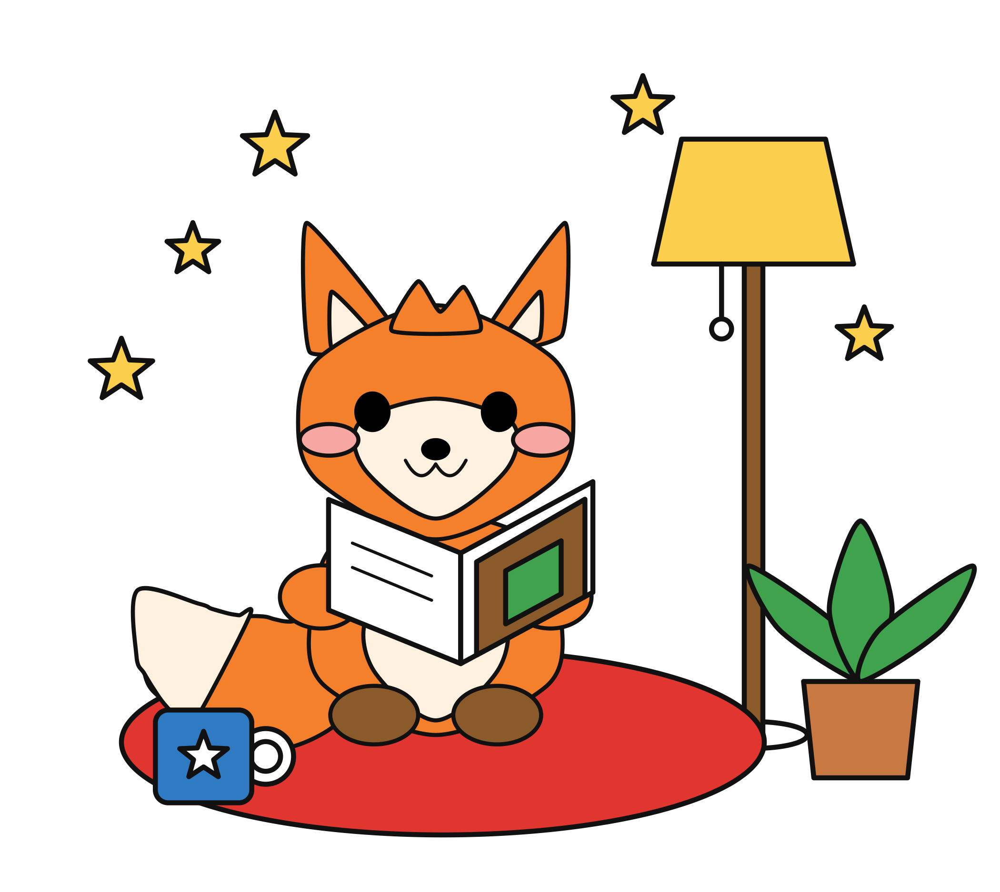 | 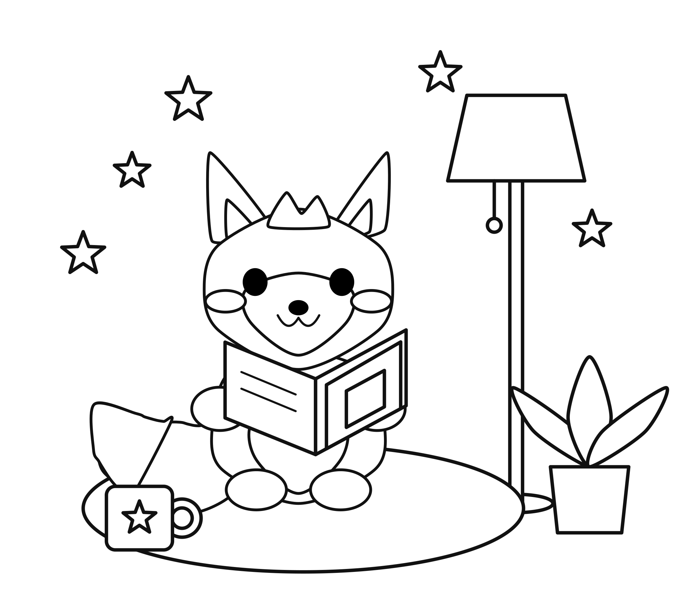 |

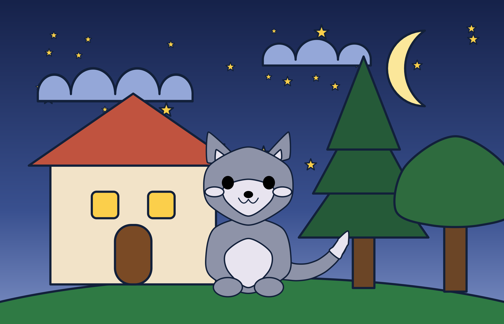

المشهدان أعلاه من **نفس الكود**: عنصر `creature` واحد يرسم الثعلب والقطة، وتتغيّر
المعاملات فقط.

## معرض: عشر صفحات تلوين بنمط اللوحتين

نفس المحرّك، بلا أي تعديل في الكود، يرسم عشرة كائنات مختلفة — فيل، بطريق، سنجاب،
قضاعة، قنفذ، هريرة، جرو، باندا، غزال، أرنب — كل واحد بنسخة ملوّنة صغيرة أعلى ونسخة
خطوط كبيرة للتلوين أسفل، في صورة واحدة (`panels` في ملف المشهد). التفاصيل والوصف
العربي الأصلي لكل مشهد في `descriptions/`.

| | | |
|---|---|---|
| 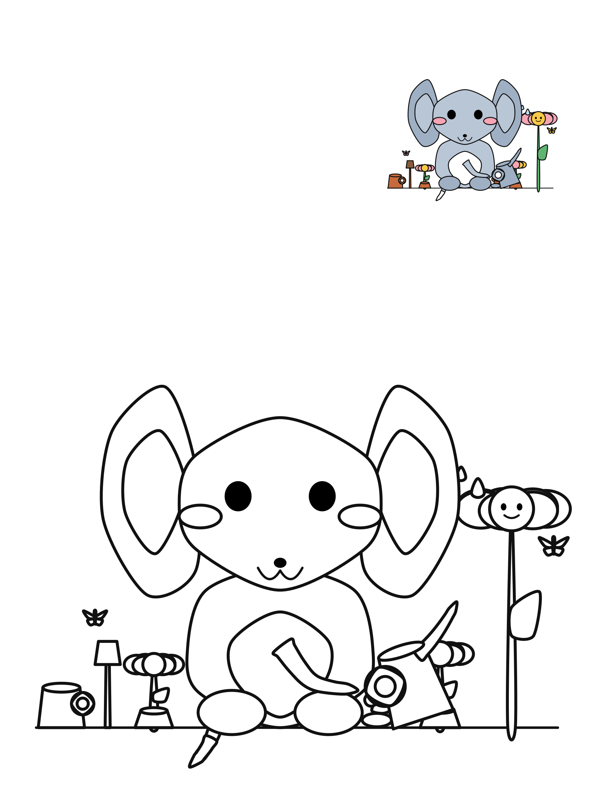 فيل وحديقة | 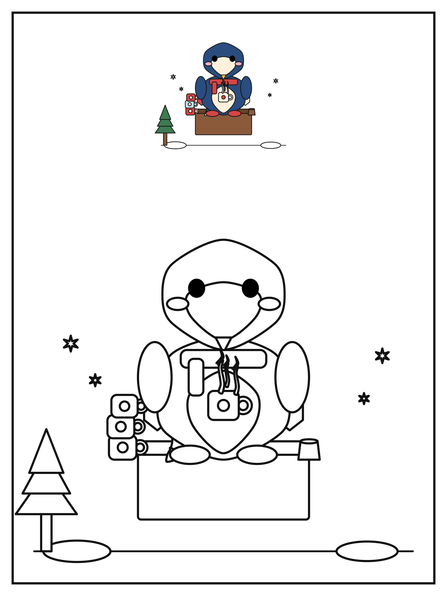 بطريق وكاكاو | 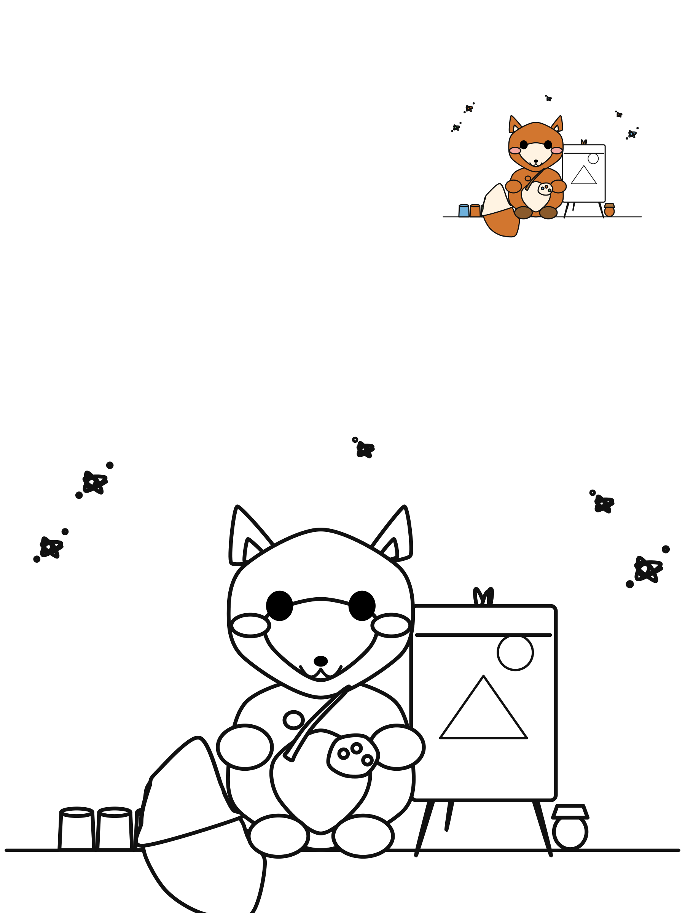 سنجاب رسّام |
| 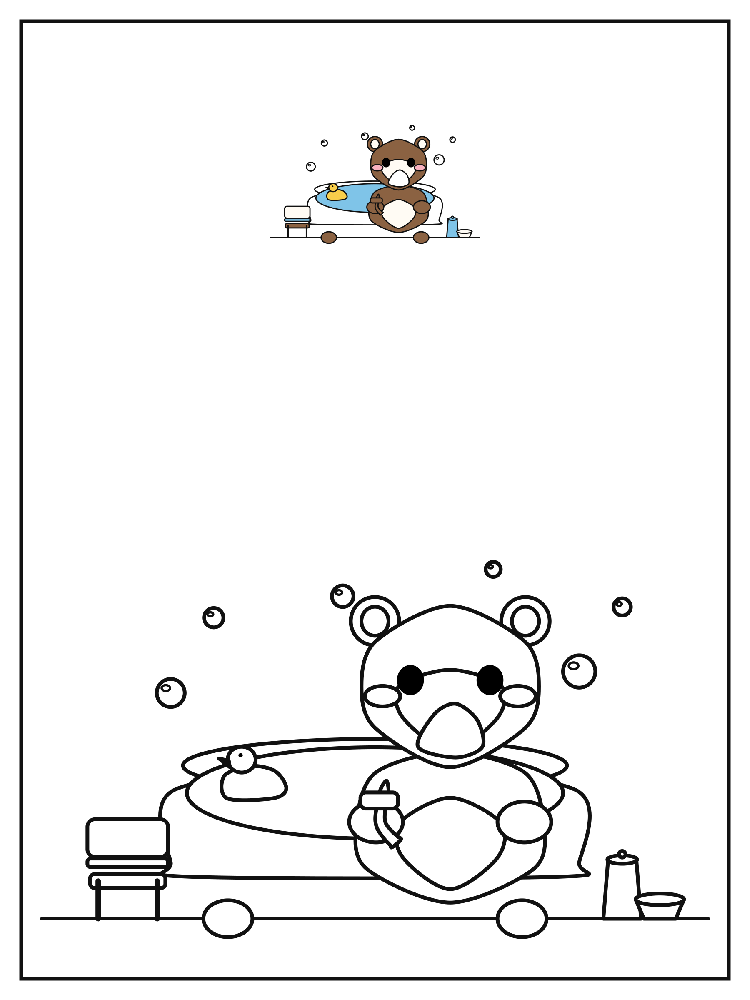 قضاعة وحوض استحمام | 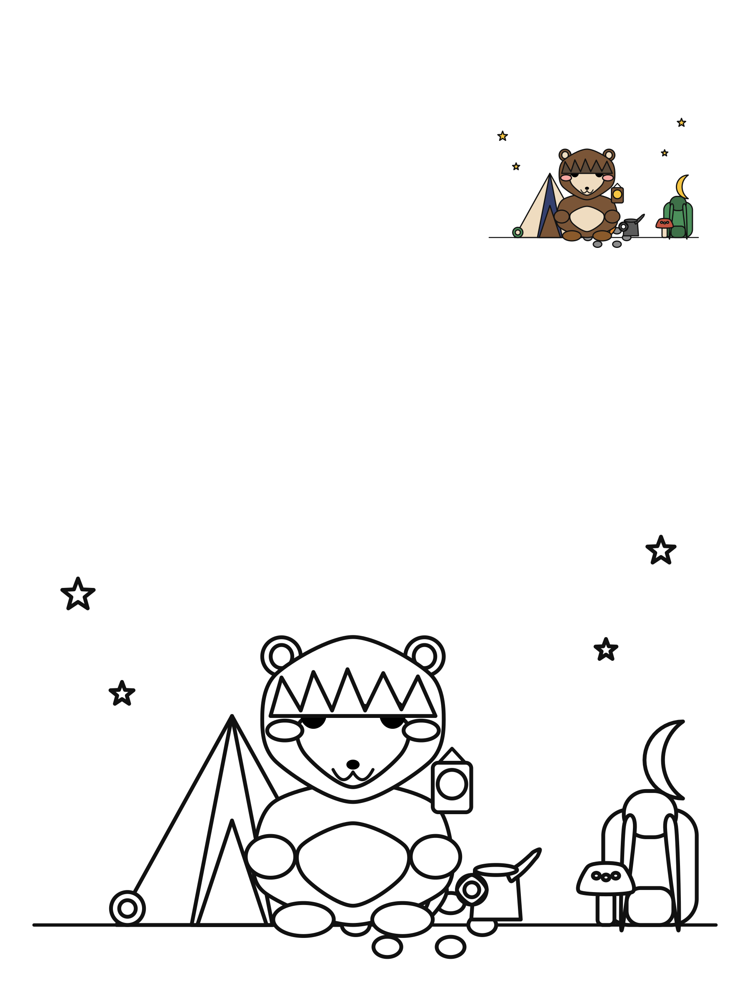 قنفذ مخيِّم | 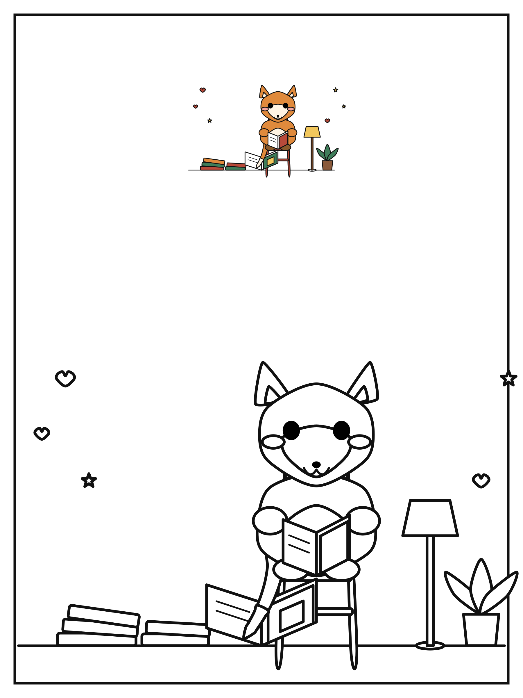 هريرة ومكتبة |
| 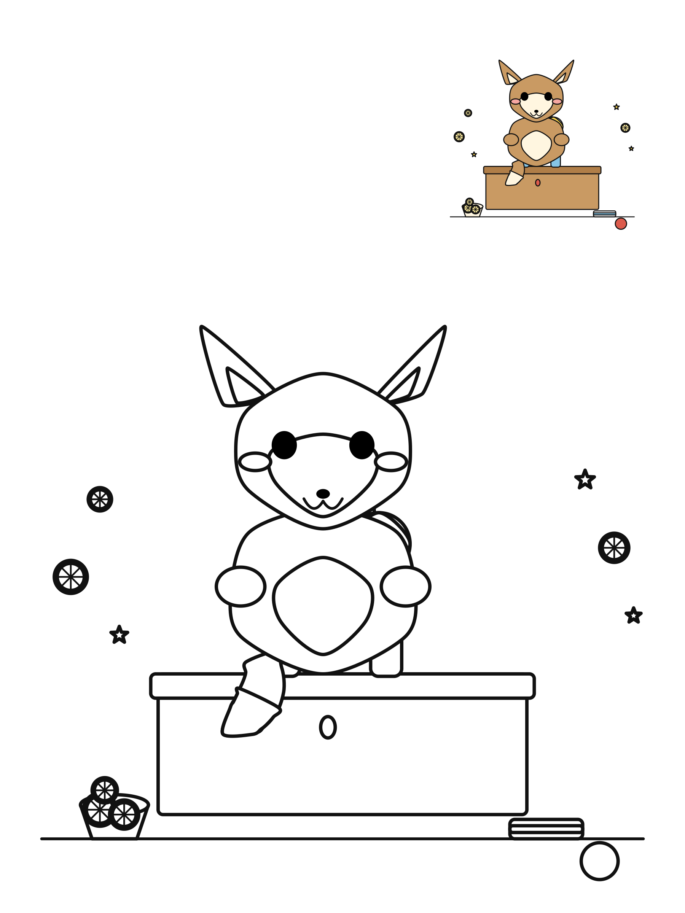 جرو وعصير ليمون | 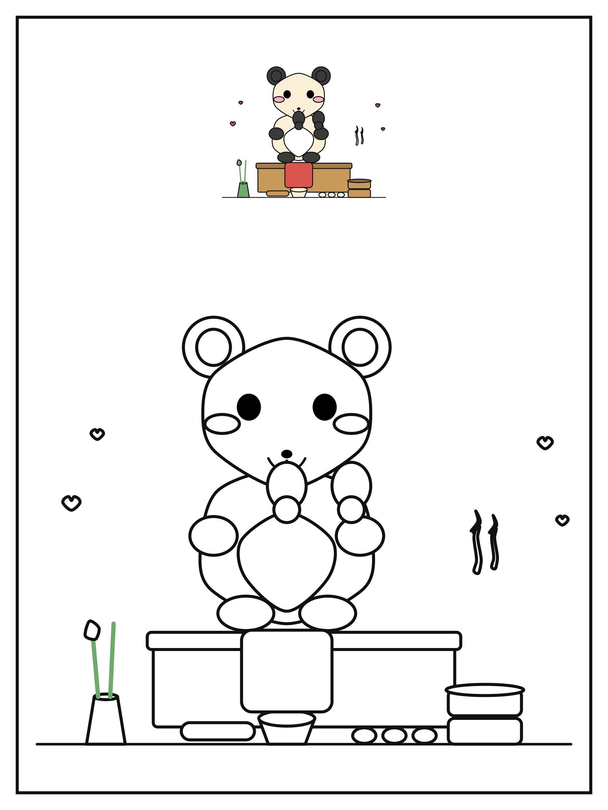 باندا وزلابية | 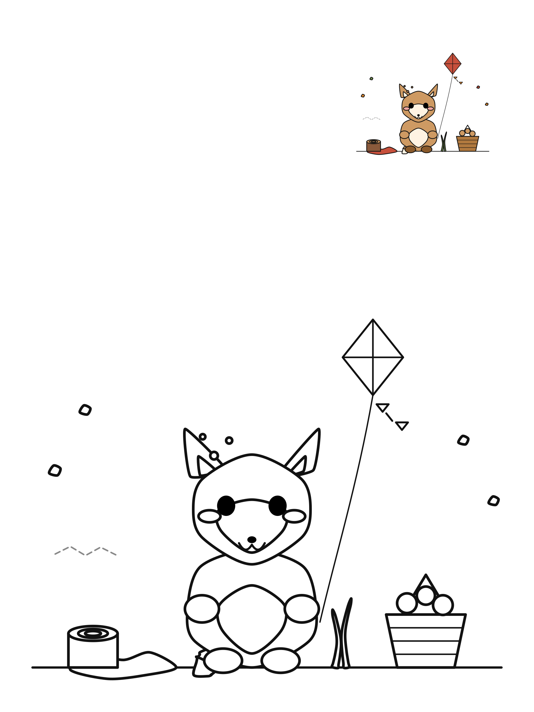 غزال وطائرة ورقية |
| 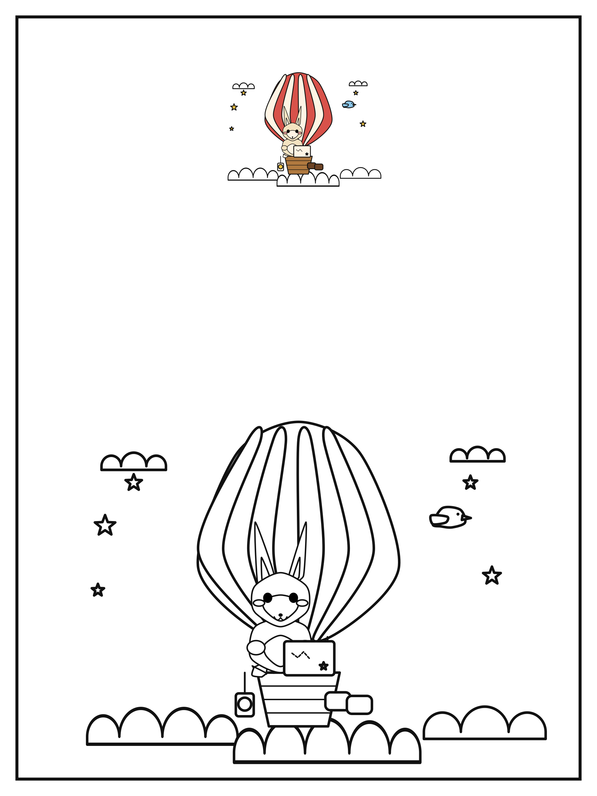 أرنب ومنطاد | | |

## التشغيل محلياً

```bash
pip install -r requirements.txt
python render.py --all              # يرسم كل ما في scenes/
python render.py scenes/fox_reading.yaml
```

يحتاج تحويل PNG إلى مكتبة cairo على النظام (`libcairo2` على أوبونتو).

## البنية

```
drawlib/geometry.py   دوال هندسية: منحنيات ناعمة، نجوم، بيزييه، أنابيب متدرّجة السُّمك
drawlib/elements.py   الأشكال الأولية وعنصر creature (كائن حيّ معلَّم بالكامل)
drawlib/props.py      عناصر إضافية: أثاث ونباتات وأدوات يومية (48 عنصراً إجمالاً)
drawlib/scene.py      قراءة YAML، الألوان، التحويلات، وضع الخطوط، تركيب اللوحتين
render.py             سطر الأوامر
scenes/*.yaml         ملفات المشاهد
descriptions/*.md     الوصف العربي الأصلي لكل مشهد
renders/              الناتج (يكتبه الـ workflow)
```

## كيف تطلب رسمة جديدة

اقرأ [`docs/how-to-describe.md`](docs/how-to-describe.md).

باختصار: اكتب وصفاً بالعربية → يُترجم إلى `scenes/<اسم>.yaml` → ادفع التغيير →
يرسم GitHub Actions ويحفظ الصورة في `renders/`.

## مثال على ملف مشهد

```yaml
canvas: {width: 1400, height: 1250, background: "#ffffff"}
mode: both                    # color | line | both
palette:
  fur: "#F4802B"
layers:
  - element: cushion
    at: [620, 1040]
    params: {width: 900, height: 260, fill: "#E1362F"}
  - element: creature
    at: [610, 1030]
    scale: 0.82
    params:
      fur: "$fur"
      ears: {shape: pointed, width: 150, height: 235, spread: 140, tilt: 20}
      tail: {shape: bushy, length: 330, angle: 172}
```

أسماء العناصر والمفاتيح تقبل مرادفات عربية (`نجمة`، `موضع`، `خصائص`).

## ملف قديم

`fox_coloring_page.py` هو المحاولة الأولى بـ matplotlib بإحداثيات مكتوبة يدوياً.
بقي كمثال مستقل؛ النظام الموصوف أعلاه هو ما حلّ محلّه.
